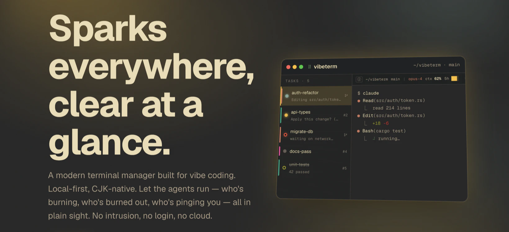

<div align="center">



# VibeTerm

**画面いっぱいの火花、ひと目で見渡す。**

vibe coding のためのモダンなターミナルマネージャー。ローカルファースト、CJK ネイティブ。agent はそれぞれ走らせて、どれが燃え、どれが消え、どれが呼んでいるか、すべて見渡せる。侵入しない、ログインしない、クラウドに上げない。

[](LICENSE)
[](https://github.com/fjlmcm/VibeTerm/releases)
[](https://github.com/fjlmcm/VibeTerm/releases)
[](https://github.com/fjlmcm/VibeTerm)

[**www.vibeterm.org**](https://www.vibeterm.org) · [**ダウンロード**](https://github.com/fjlmcm/VibeTerm/releases) · [**GitHub**](https://github.com/fjlmcm/VibeTerm)

[English](README.md) · [简体中文](README.zh.md) · [繁體中文](README.zh-hant.md) · **日本語** · [한국어](README.ko.md) · [Tiếng Việt](README.vi.md) · [Bahasa Indonesia](README.id.md) · [Español](README.es.md) · [Português](README.pt-br.md) · [Deutsch](README.de.md) · [Français](README.fr.md) · [Italiano](README.it.md) · [Русский](README.ru.md) · [Türkçe](README.tr.md)

</div>

---

## agent の仕事はやらない。ただ見張るだけ。

- **設定に触らない** — 状態は「見て」判断します:出力を読む、ファイルを読み取り専用で監視する。~/.claude や ~/.codex に書き込まないし、hook も入れない、常駐サービスも立てない。agent の設定は 1 バイトも触りません。
- **たくさんの agent をさばく** — agent が増えると散らかります。停止したもの、入力待ちのものを上に出すので、一個ずつ開いて確認しなくて済みます。
- **ターミナルはターミナルのまま** — ターミナルの基本をちゃんとやる。機能を盛らないし、agent ワークベンチになるつもりもない。
- **CJK がちゃんと動く** — 全角文字、IME 入力、emoji 入りのコピー。英語圏のターミナルがよく外すところを、ここはちゃんと処理しています。
- **全部あなたのマシンの中** — ログイン不要、データ収集なし、デフォルトでオフライン。手動で更新を確認したときだけ通信して、それも読むだけ。
- **MIT、オープンソース** — コードは全部公開。読むのも変えるのも自由です。

## 5 つの状態、ぱっと見で。

- 🔵 **実行中** — 青い点が灯ってグロー。agent は作業中。
- 🟡 **入力待ち** — 黄色い点が呼吸。入力待ち、見てあげて。
- 🔴 **停止** — 赤橙のリング。5 分以上静か、たぶん停止している。
- ⚪ **アイドル** — 灰色の点が静止。何もしてない。
- 🟢 **完了** — リングに取り消し線。これは本当に終わった。

## ターミナルに要るものは全部、それと agent 向けのあれこれ。

_普通のターミナル機能は一通り、そこに画面いっぱいの AI agent 向けの状態把握と編成を足してます。_

### Agent

- **agent が何してるか見える** — 実行中、入力待ち、停止、完了。設定に触らず判別します。
- **停止検出 + 緊急度ソート** — 画面いっぱいの agent でも、停止したものと入力待ちのものが上に来ます。
- **使用量をリアルタイムで** — コンテキスト残量、5h/7d クォータ、消費ペース、キャッシュ、コスト。1 本のバーに。
- **使用量の集計** — Claude / Codex のトークンとコスト。オフラインで計算、エクスポート可。

### ターミナル

- **分割 + worktree** — git worktree をマウント、タスクごとに自分のターミナルツリー。
- **Canvas ボード** — タスクをカードに並べて、範囲選択、1 つのコマンドを複数ターミナルへ。
- **フローティング窓** — 好きなタスクを別窓に切り出して、走らせながら見張る。
- **GPU レンダリング** — WebGL で高速、それでも CJK は文字を落とさず、もたつかない。

### 効率

- **コマンドパレット** — キーバインドもアクションも自分で設定。キーボードだけで回せる。
- **プロンプト定型** — claude / codex / shell のよく使う定型、すぐ呼べる。
- **ステータスバー自由に** — ウィジェットをドラッグで配置、agent の種類ごとに別設定。
- **デスクトップ通知** — 内蔵 24 サウンド + 通知オフ時間。agent の状態が変わったときだけ鳴る。
- **テーマを即切替** — 内蔵 10 テーマをいつでも切替、macOS も Windows も。

## 設定に触らずに、どうやって agent の動きがわかるの?

3 通りの「見方」と、読み取り専用のファイル監視。hook なし、ログインなし、何も書きません。

1. **OSC 133 / 633 シーケンス** — シェル統合が出すコマンド境界マーカー。いちばん確実な層で、コマンドの開始・終了・入力待ちを正確に捉えます。
2. **agent の出力を読む** — よくある 11 個の agent の承認プロンプトを照合して、「入力待ち」を見分けます。
3. **タイトルのあの回転** — ウィンドウタイトルの braille スピナーが動いてたら、agent は作業中。

> **一線:あなたのものには触らない** — ~/.claude や ~/.codex に書かない、hook を入れない、常駐サービスも立てない。状態は全部「見て」るだけ、「差し込む」ことはしません。

## 英語圏の主要な AI ターミナルで、CJK を本気で見てるのは一つもない。

ほとんどの主要 AI ターミナルのリポジトリに、CJK のバグが未対応で残っている。英語ユーザーの急ぎの案件に埋もれている。この部分は誰もまともに手を付けてこなかった。VibeTerm はそこを本業として扱う。

- IME 変換を最後まで押さえる(isComposing / keyCode 229)。誤送信もラグもない。
- 全角・曖昧幅を正しく測るので、表が崩れない。
- 中国語の折り返しが切れない。ストリーミングでも文字を割らない。
- コピーは Intl.Segmenter で保護、サロゲートペアや ZWJ を壊さない。
- GPU レンダリングでも CJK を落とさず、ずれない。

## 試してみる?

macOS 11+ と Windows に対応、同じページから。

**[ダウンロード →](https://github.com/fjlmcm/VibeTerm/releases)** — macOS `.dmg` · Windows `.exe` / `.msi`.

またはソースからビルド:

```bash
pnpm install
pnpm build      # = tauri build → src-tauri/target/release/bundle/
pnpm dev        # dev (Vite HMR + tauri dev)
```

Built with **Tauri 2 · Rust · SolidJS · xterm.js** (pnpm monorepo).

## これらの上に立ってます。

ryoppippi さんの ccusage(MIT)に感謝。使用量の集計、モデル価格、5 時間ブロックはここから参考にしました。価格データは LiteLLM と Anthropic 公式から。

Also building on [Tauri](https://tauri.app) · [SolidJS](https://solidjs.com) · [xterm.js](https://xtermjs.org) · [WezTerm](https://github.com/wezterm/wezterm) · [Tabby](https://github.com/Eugeny/tabby). Full list in [THIRD-PARTY-NOTICES.md](THIRD-PARTY-NOTICES.md).

## MIT License

[MIT](LICENSE) · © 2026 VibeTerm contributors
