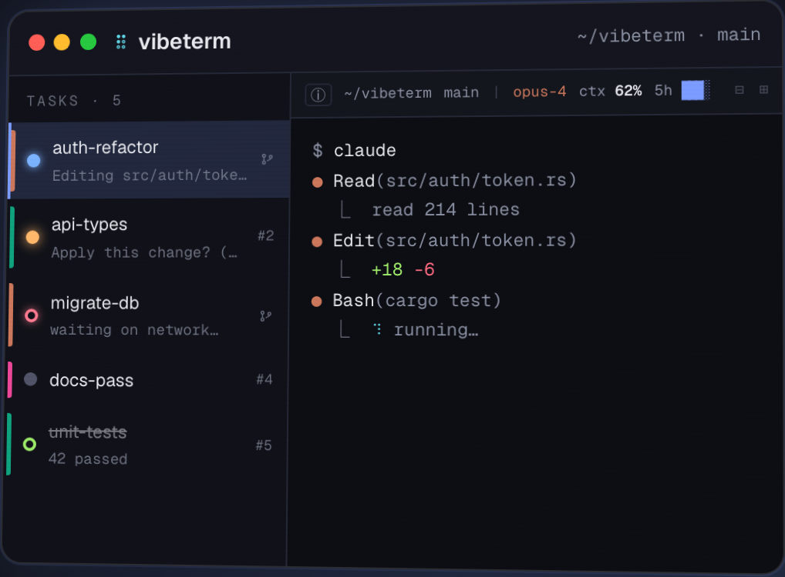

<div align="center">



# VibeTerm

**곳곳에 불꽃, 한눈에 또렷이.**

vibe coding을 위한 모던 터미널 매니저. 로컬 우선, CJK 네이티브. 에이전트는 각자 돌게 두고 — 뭐가 타오르고, 뭐가 꺼졌고, 뭐가 당신을 부르는지 한눈에 보입니다. 침범 없음, 로그인 없음, 클라우드 없음.

[](LICENSE)
[](https://github.com/fjlmcm/VibeTerm/releases)
[](https://github.com/fjlmcm/VibeTerm/releases)
[](https://github.com/fjlmcm/VibeTerm)

[**www.vibeterm.org**](https://www.vibeterm.org) · [**다운로드**](https://github.com/fjlmcm/VibeTerm/releases) · [**GitHub**](https://github.com/fjlmcm/VibeTerm)

[English](README.md) · [简体中文](README.zh.md) · [繁體中文](README.zh-hant.md) · [日本語](README.ja.md) · **한국어** · [Tiếng Việt](README.vi.md) · [Bahasa Indonesia](README.id.md) · [Español](README.es.md) · [Português](README.pt-br.md) · [Deutsch](README.de.md) · [Français](README.fr.md) · [Italiano](README.it.md) · [Русский](README.ru.md) · [Türkçe](README.tr.md)

</div>

---

## 에이전트를 대신 돌리지 않습니다. 그저 지켜볼 뿐.

- **설정을 건드리지 않음** — 상태는 '지켜봐서' 알아냅니다: 출력을 읽고, 파일은 읽기 전용으로만 들여다봅니다. ~/.claude나 ~/.codex에 절대 쓰지 않고, hook도 안 깔고, 백그라운드 서비스도 안 띄웁니다. 당신의 에이전트 설정은 1바이트도 건드리지 않습니다.
- **여러 에이전트도 거뜬히** — 에이전트가 몇 개만 돼도 정신없어집니다. 멈춘 것과 당신을 기다리는 것을 위로 올려주니, 하나씩 열어 누가 급한지 확인할 필요가 없습니다.
- **터미널은 터미널답게** — 터미널의 기본을 제대로 합니다. 기능을 욱여넣지 않고, 에이전트 워크벤치가 될 생각도 없습니다.
- **CJK가 제대로 동작** — 전각 문자, IME 입력, emoji가 섞인 복사 — 영어권 터미널이 자꾸 틀리는 부분, 여기선 제대로 처리합니다.
- **모든 게 당신 기기 안에** — 로그인 없음, 데이터 수집 없음, 기본 오프라인. 직접 업데이트를 확인할 때만 통신하고, 그것도 읽기만 합니다.
- **MIT, 오픈소스** — 코드는 전부 공개. 읽든 고치든 마음대로.

## 다섯 가지 상태, 한눈에.

- 🔵 **실행 중** — 푸른 점이 은은히 빛남. 에이전트가 작업 중.
- 🟡 **입력 대기** — 노란 점이 숨 쉬듯 깜빡임. 당신을 기다리는 중이니 한번 봐줄 때.
- 🔴 **멈춤** — 붉은 주황 링. 5분 넘게 조용하면, 아마 멈춘 것.
- ⚪ **유휴** — 회색 점 멈춤. 아무것도 안 함.
- 🟢 **완료** — 테두리 링에 취소선. 이건 정말 끝난 것.

## 터미널에 필요한 건 다, 거기에 에이전트용까지.

_여느 터미널 기능은 그대로, 화면 가득한 AI 에이전트를 위한 상태 파악과 편성을 더했습니다._

### 에이전트

- **에이전트가 뭐 하는지 파악** — 실행 중, 대기, 멈춤, 완료 — 설정을 건드리지 않고 알아냅니다.
- **멈춤 감지 + 긴급도 정렬** — 화면 가득한 에이전트에서, 멈춘 것과 당신을 기다리는 게 위로 올라옵니다.
- **사용량 실시간** — 남은 컨텍스트, 5h/7d 쿼터, 소모 속도, 캐시, 비용 — 한 줄에.
- **사용량 통계** — Claude / Codex의 토큰과 비용. 오프라인 집계, 내보내기 가능.

### 터미널

- **분할 + worktree** — git worktree를 마운트, 작업마다 독립된 터미널 트리.
- **Canvas 보드** — 작업을 카드로 배치, 드래그 선택, 한 명령을 여러 터미널로.
- **플로팅 창** — 아무 작업이나 별도 창으로 띄워 지켜보기.
- **GPU 렌더링** — WebGL 가속, 그래도 CJK는 글자를 빠뜨리거나 버벅이지 않음.

### 효율

- **명령 팔레트** — 단축키와 액션을 직접 설정. 키보드만으로 다 됩니다.
- **프롬프트 프리셋** — claude / codex / shell용 프리셋, 한 번에 호출.
- **설정 가능한 상태바** — 위젯을 드래그로 배치, 에이전트 종류별로 따로.
- **데스크톱 알림** — 내장 24개 사운드 + 방해 금지 시간, 에이전트 상태가 바뀔 때만.
- **테마 즉시 전환** — 내장 10개 테마 언제든 전환, macOS · Windows.

## 설정을 건드리지 않고 어떻게 에이전트가 뭐 하는지 알까?

세 가지 '지켜보기'와 읽기 전용 파일 감시. hook 없음, 로그인 없음, 아무것도 쓰지 않음.

1. **OSC 133 / 633 시퀀스** — 셸 통합이 내보내는 명령 경계 마커. 가장 믿을 만한 층으로, 명령이 언제 시작·종료·입력 대기인지 정확히 압니다.
2. **에이전트 출력 읽기** — 흔한 11개 에이전트의 승인 프롬프트를 대조해 '당신을 기다리는' 상태인지 짚어냅니다.
3. **타이틀의 그 스피너** — 창 제목의 braille 스피너가 돌고 있으면, 에이전트는 작업 중.

> **한 가지 원칙: 당신 것엔 손대지 않음** — ~/.claude나 ~/.codex에 쓰지 않고, hook을 깔지 않고, 백그라운드 서비스를 띄우지 않습니다. 모든 상태는 '지켜본' 것이지 '끼워 넣은' 게 아닙니다.

## 영어권 주요 AI 터미널 중 CJK를 진지하게 보는 건 하나도 없습니다.

거의 모든 주요 AI 터미널 저장소에 CJK 버그가 미해결로 쌓여 있고, 영어 사용자의 급한 일에 묻혀 있습니다. 이 부분은 제대로 손본 적이 없습니다. VibeTerm은 이걸 본업으로 여깁니다.

- IME 조합을 끝까지 가로챔(isComposing / keyCode 229). 오입력도 렉도 없음.
- 전각·모호 폭을 정확히 측정해 표가 어긋나지 않음.
- 줄바꿈이 잘리지 않고, 스트리밍에서도 글자를 쪼개지 않음.
- 복사는 Intl.Segmenter로 보호해 서로게이트 페어나 ZWJ를 깨지 않음.
- GPU 렌더링에서도 CJK를 빠뜨리거나 밀리지 않음.

## 한번 써볼까?

macOS 11+와 Windows, 같은 페이지에서.

**[다운로드 →](https://github.com/fjlmcm/VibeTerm/releases)** — macOS `.dmg` · Windows `.exe` / `.msi`.

또는 소스에서 빌드:

```bash
pnpm install
pnpm build      # = tauri build → src-tauri/target/release/bundle/
pnpm dev        # dev (Vite HMR + tauri dev)
```

Built with **Tauri 2 · Rust · SolidJS · xterm.js** (pnpm monorepo).

## 이들의 어깨 위에서.

ryoppippi의 ccusage(MIT)에 특별히 감사. 사용량 집계, 모델 가격, 5시간 블록은 여기서 참고했습니다. 가격 데이터는 LiteLLM과 Anthropic 공식 수치에서.

Also building on [Tauri](https://tauri.app) · [SolidJS](https://solidjs.com) · [xterm.js](https://xtermjs.org) · [WezTerm](https://github.com/wezterm/wezterm) · [Tabby](https://github.com/Eugeny/tabby). Full list in [THIRD-PARTY-NOTICES.md](THIRD-PARTY-NOTICES.md).

## MIT License

[MIT](LICENSE) · © 2026 VibeTerm contributors
